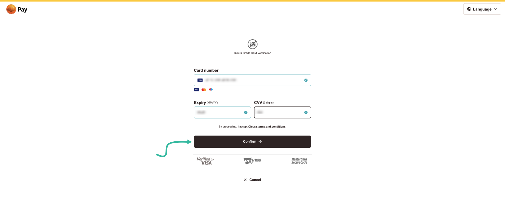

# Managing your credit card information

You may add or change credit card information via the [{{gui}}](https://{{gui_domain}}).

## Prerequisites

You must be logged in to your [Cleura Cloud](https://{{gui_domain}}) account to manage credit card information.

## Adding a credit card

In the {{gui}}, make sure the vertical pane on the left is visible.
Click on _Settings_, and then on _Manage Invoice Settings._
In the central pane, named _Invoice Settings,_ notice the three tabs at the top.
Click on the one labeled _Credit Cards,_ and then on the _Add New Card_ button below.

You are redirected to a PayEx Sverige AB page, where you enter your credit card information.
When you are done, click the black _Confirm_ button.

To confirm the new card, {{brand}} charges you zero (0) units of your card's currency.
Depending on your bank, you might have to use whatever mechanism is provided to authorize that zero charge.

Once the new credit card is added, it will be visible in the _Credit Cards_ tab.

## Changing a credit card

If you want to use another credit card, click the _Add New Card_ button below the existing card.

Configure the new card as you did when adding the existing card.
When you are done adding the new one, you will realize that the old one is no longer listed under _Credit Cards._
In addition to the old card not being visible, please keep in mind that it is also __removed__ from the system.

## Removing a credit card

To remove a credit card you have already added to your account, you need to send an email to [{{support_email}}](mailto:{{support_email}}).
This email should come either from the technical contact address or the billing contact address of [your account](change-account-data.md).
